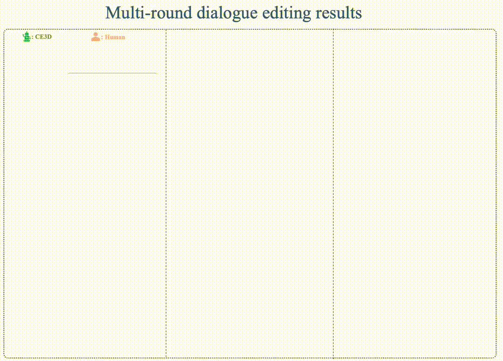

## Chat Edit 3D: Interactive 3D Scene Editing via Text Prompts, :heart: ECCV2024
## :star2: :star2: CE3D leverages an LLM to integrate dozens of different models :star2: :star2:


## [Project Page](http://sk-fun.fun/CE3D/) | [Paper](https://arxiv.org/abs/2407.06842) | [Video](https://www.youtube.com/watch?v=btO1Ky9I21s) | [Datasets and Ckpts](https://drive.google.com/drive/folders/1KUIFMgvHeZtKIML-hzzBIjZ-3Kxo4JGt?usp=drive_link) | 

# Updates
  - [x] **Hash-Atlas codes have been released** in the folder of *hash_atlas*
  - [x] **Pretrained weights have been released**
  - [x] **a dataset example has been released**  (More will be soon)
  - [ ] Release LLM-driven dialogue codes

<be>



# Quick Start
#### Create a new environment & Activate the new environment
```
https://github.com/Fangkang515/CE3D.git
cd CE3D

conda create -n CE3D python=3.10
conda activate CE3D

pip install -r requirements.txt
pip install  git+https://github.com/IDEA-Research/GroundingDINO.git
pip install  git+https://github.com/facebookresearch/segment-anything.git

install tiny-cuda-nn according to https://github.com/NVlabs/tiny-cuda-nn/tree/master

```

#### Download the checkpoints / pretrained-weights / dataset examples
```
# Download the checkpoints (sam, dino, et.al) from [Here]()
unzip checkpoints.zip

# Download the pretrained-weights (atlas) from [Here](https://drive.google.com/file/d/14FY23C8u9-igNCm1Wo1Mm8JVs35sszw6/view?usp=sharing)
cd hash_atlas
unzip weights.zip
cd ..

# Download the dataset example from [Here](https://drive.google.com/file/d/1nsWj1La8sTAj88Kbc9f0VSbLOwIyoNtZ/view?usp=drive_link)
cd datasets
unzip flower.zip
cd ..
```

#### If you want to manually train the Atlas 
```
# note: (the final code will be automatically executed to obtain Atlas of a 3D scene)
# 
cd hash_atlas
python atlas_playground.py

# Then You will find an atlas_space folder in the ../datasets/lower directory, like below:
 |-flower   
    |-XXX
    |-work_space
    |  |atlas_space
    |  |  |flow
    |  |  |mask
    |  |  |propainter
    |  |  |training_results
    |  |final_atlas
    |  |  | atlas_ori_foreground.png
    |  |  | atlas_ori_background.png
    |  |editing_space
    |  |  |XXX
```


## Citation

If you find our code or paper useful, please consider citing
```
@article{fang2024chat,
  title={Chat-Edit-3D: Interactive 3D Scene Editing via Text Prompts},
  author={Fang, Shuangkang and Wang, Yufeng and Tsai, Yi-Hsuan and Yang, Yi and Ding, Wenrui and Zhou, Shuchang and Yang, Ming-Hsuan},
  journal={arXiv preprint arXiv:2407.06842},
  year={2024}
}
```


